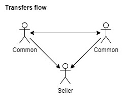
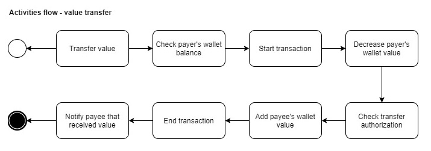
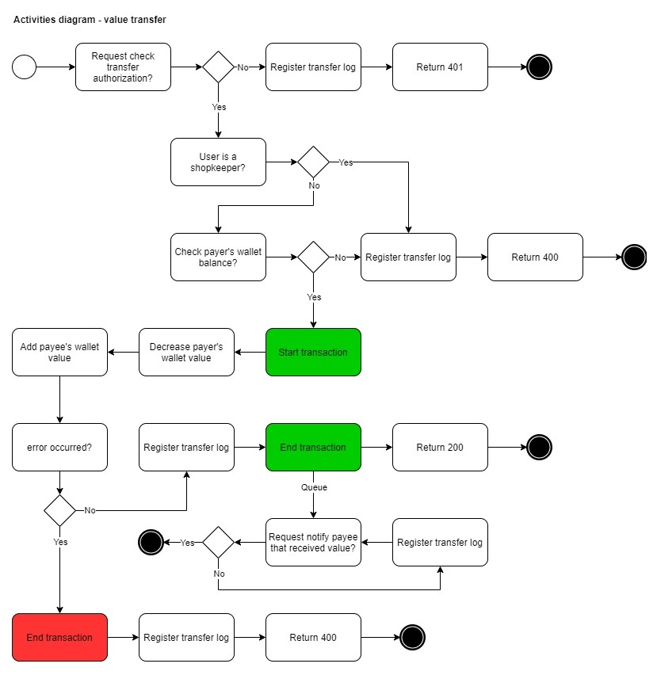

# Papibaquigrafo

Clone and run, simple as that!

## Attention ⚠️

Run command:
```bash
docker-compose up -d
```
And access the address in your browser:
```
http://localhost:8080/
```

---
## Diagrams 🤯

Some flow diagrams can help you to understand the application proposal.

### Transfers Flow


### Activities Flow


### Activities Diagram


---
## Routes 🌎

|Method |Action                 |Params|
|-------|-----------------------|------------------|
|POST   |`.../transfer-values`  |`user email payer`, `user email payee`, `value`|
|GET    |`.../detail-transfers` |`user email`|

---
## Controllers 🎮

### TransferController
---
## Services 💰

### WalletService
- hasBalanceToValue($value)
- sendValue($value, $payer, $payee)

---
## Repositories 🔍
### WalletRepository
- updateValue($owner, $value)

### TransferLogRepository

### SystemLogRepository

---
## Models 💾
### User

### Wallet

### TransferLog

### SystemLog

### Job
