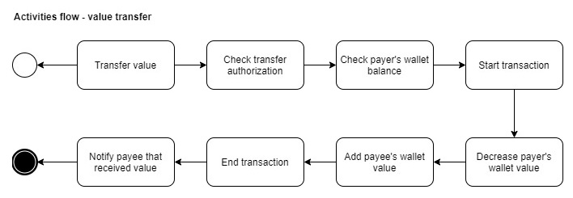
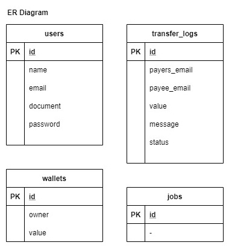

# Papibaquigrafo

Clone and run, simple as that!

---
## Dev environment onfiguration .env

```bash
DB_CONNECTION=mysql
DB_HOST=127.0.0.1
DB_PORT=3306
DB_DATABASE=papibaquigrafo
DB_USERNAME=root
DB_PASSWORD=papibaquigrafo

CACHE_DRIVER=file
QUEUE_CONNECTION=database
```
---
## Attention ⚠️

Run command:
```bash
docker-compose up -d
```
And access the address in your browser:
```
http://localhost:8080/
```

To use test database, run:
```bash
php artisan migrate
```
```bash
php artisan db:seed
```

To process the queue that sends the transfer notification to the user, run:
```bash
php artisan queue:listen
```
---
## Diagrams 🤯

Some flow diagrams can help you to understand the application proposal.

### Transfers Flow


### Activities Flow


### Activities Diagram


### ER Diagram


---
## Routes 🌎

|Method |Action                 |Params|
|-------|-----------------------|------------------|
|POST   |`.../values-transfers` |`user email payer`, `user email payee`, `value`|

---
## Job 🕐
### NotificationJob


---
## Middleware 🔞
### TransferAuthMiddleware
---
## Rules ✔️
### EmailRule
### ValueRule
---
## Controllers 🎮
### TransferController
---
## Services 💰

### NotificationService
### TransferAuthService
### WalletService

---
## Repositories 🔍
### TransferLogRepository
### WalletRepository
### WalletRepository

---
## Models 💾
### User

### Wallet

### TransferLog
